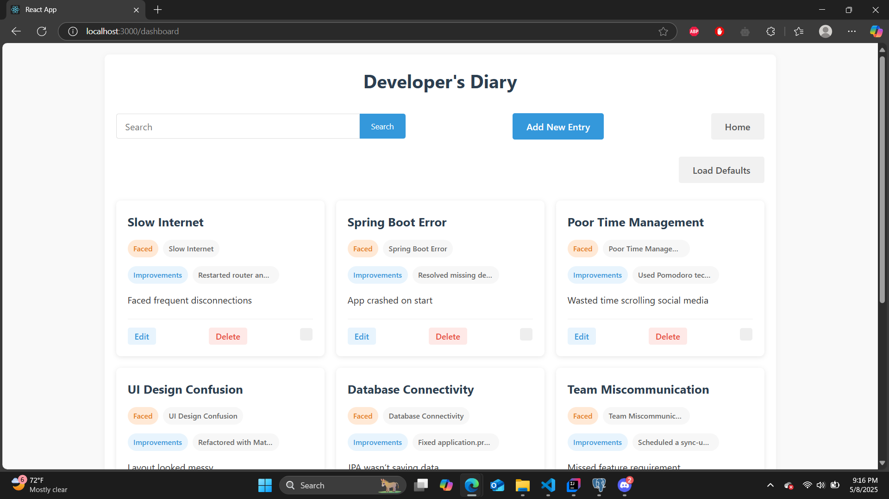

# Developer's Diary

A full-stack web application for developers to document their journey, track progress, and maintain coding records.


## 📋 Overview

Developer's Diary is a platform designed for developers to document their coding journey, track progress, and maintain technical records. With a clean, responsive UI built on Material UI, the application offers an intuitive user experience with minimal animations and a user-centered dashboard.

## ✨ Features

- **Clean & Responsive UI** built with Material UI
- **Card-Based Diary Posts** for easy visualization
- **Advanced Record Tracking** with robust search functionality
- **User-Centered Dashboard** with clean, minimal animations
- **Database-Driven Architecture** for reliable data persistence
- **RESTful API Design** for seamless front-end and back-end communication

## 🛠️ Tech Stack

### Frontend
- **React** - JavaScript library for building user interfaces
- **Material UI** - React component library implementing Google's Material Design

### Backend
- **Spring Boot** - Java-based framework for creating stand-alone, production-grade applications
- **Maven** - Software project management and comprehension tool

### Database
- **PostgreSQL** - Open-source relational database system

## 🚀 Installation & Setup

### Prerequisites
- Node.js (v14.x or above)
- Java JDK 11 or above
- Maven
- PostgreSQL

### Frontend Setup
```bash
# Clone the repository
git clone https://github.com/yourusername/developers-diary.git

# Navigate to the frontend directory
cd developers-diary/frontend

# Install dependencies
npm install

# Start the development server
npm start
```

### Backend Setup
```bash
# Navigate to the backend directory
cd ../backend

# Build the project
mvn clean install

# Run the application
mvn spring-boot:run
```

### Database Configuration
1. Create a PostgreSQL database named `developers_diary`
2. Update the database configuration in `application.properties`

## 📸 Screenshots

### 🏠 Home Page


### 📊 Dashboard


### ➕ Add Entry Page


## 🔍 API Documentation

The backend exposes a RESTful API for communication with the frontend:

- `GET /api/posts` - Retrieve all diary posts
- `GET /api/posts/{id}` - Retrieve a specific diary post
- `POST /api/posts` - Create a new diary post
- `PUT /api/posts/{id}` - Update an existing diary post
- `DELETE /api/posts/{id}` - Delete a diary post
- `GET /api/posts/search?keyword={keyword}` - Search diary posts

## 📝 Future Improvements

- [ ] Implement user authentication and authorization
- [ ] Add tagging functionality to diary posts
- [ ] Integrate with GitHub to automatically log coding activity
- [ ] Implement statistics and visualization of coding patterns
- [ ] Mobile application development

## 👨‍💻 Contributing

Contributions are welcome! Please feel free to submit a Pull Request.


---

Created with ❤️ by KhemJava